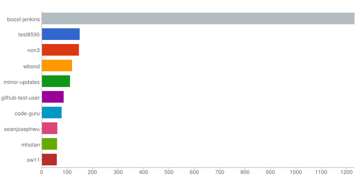
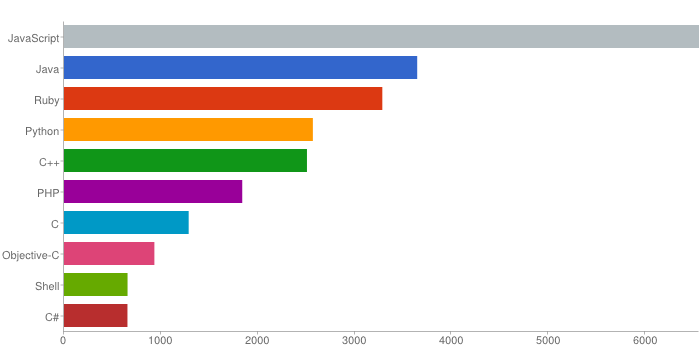

# Aktywność userów Githuba - ta ostatnia niedziela

### *Paweł Śląski*

Użyłem danych z Github Archive z dnia 19.05.2013 z godzin 20:00 - 24:00 (niedziela, wieczór)

Wykorzystałem je do policzenia, który user był najaktywniejszy w danym okresie.

Próba policzenia, który język był najpopularniejszy tego wieczoru była nieudana (problem z dostępem do zagnieżdzonego pola obiektu w mapreduce)

### Funkcja Map:

```javascript
var map = function () {
	emit({codder : this.actor}, { count: 1 });
};
```

### Funkcja Reduce:

```javascript
var reduce = function (key, values) {
    var count = 0;
    values.forEach(function (v) {
        count += v['count'];
    });
    return {count: count};
};
```

### Wyniki:
```
db.github_sunday_evening.mapReduce(map, reduce, { out: 'codder_results'});
```
Następnie wynik posortowałem według aktywności i wybrałem 10 najbardziej aktywnym userów. 
Znów wystąpił problem z zagnieżdzonym polem w mapreduce (tym razem próba sortowania), więc czynności te wykonałem za pomocą agregacji, a przy okazji "spłaszczyłem" wyniki aby lepiej się prezentowały

```ruby
result = codders.aggregate([{'$sort' => {'value.count' => -1}},
                            {'$limit' => 10},
                            {'$project' => {:_id => 0, :user => '$_id.codder', :count => '$value.count'}}])
```

Rezultat

```
{"user"=>"boost-jenkins", "count"=>1230.0}
{"user"=>"test8590", "count"=>148.0}
{"user"=>"non3", "count"=>145.0}
{"user"=>"wbond", "count"=>118.0}
{"user"=>"mirror-updates", "count"=>110.0}
{"user"=>"github-test-user", "count"=>85.0}
{"user"=>"code-guru", "count"=>77.0}
{"user"=>"seanjosephwu", "count"=>60.0}
{"user"=>"mhotan", "count"=>59.0}
{"user"=>"sw11", "count"=>58.0}
```



## A jednak, nie taka ostatnia ta niedziela - czyli, który język był najpopularniejszy - round 2

Tym razem, przy użyciu jq, wybrałem tylko te dane, które mnie interesują (dane o repozytorium + user i typ eventu) i ponownie zaimportowałem je do MongoDB.
Przy okazji pozbyłem się nulli dla niezdefiniowanych języków.

```
jq -c 'if .repository then .repository + {actor, type} else empty end | .language //= "unknown"' {plik}.json
```

### Funkcja Map:

```javascript
var map2 = function () {
	emit({lang : this.language}, { count: 1 });
};
```

### Wyniki

Ponownie przy użyciu agregacji posortowałem, oczyściłem i wybrałem 10 najbardziej popularnych języków.

```ruby
langs = lang_results.aggregate([{'$sort' => {'value.count' => -1}},
                                 {'$project' => {:_id => 0, :lang => '$_id.lang', :count => '$value.count'}},
                                 {'$match' => {:lang => {'$ne' => 'unknown'}}},
                                 {'$limit' => 10}])
```

Rezultat

```
{"lang"=>"JavaScript", "count"=>6555.0}
{"lang"=>"Java", "count"=>3646.0}
{"lang"=>"Ruby", "count"=>3286.0}
{"lang"=>"Python", "count"=>2569.0}
{"lang"=>"C++", "count"=>2508.0}
{"lang"=>"PHP", "count"=>1840.0}
{"lang"=>"C", "count"=>1287.0}
{"lang"=>"Objective-C", "count"=>933.0}
{"lang"=>"Shell", "count"=>656.0}
{"lang"=>"C#", "count"=>655.0}
```




### Plik JS
[Klik](/scripts/mapreduce_pslaski.js)
